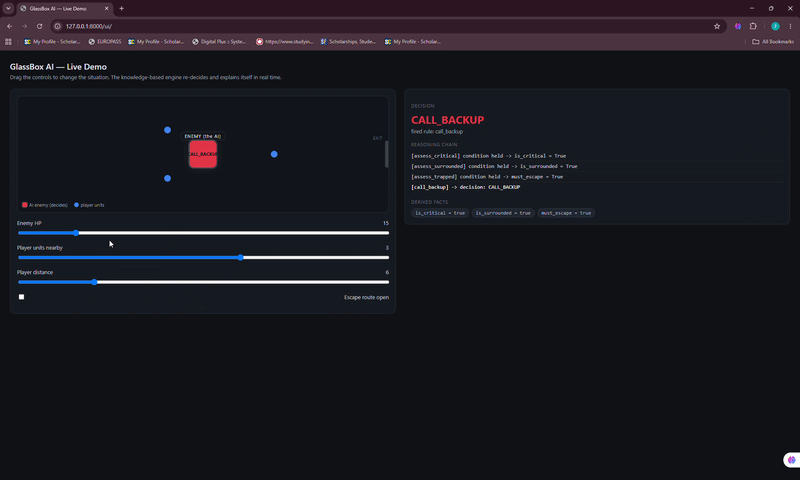

# GlassBox AI

**An explainable, knowledge-based AI engine for game NPCs — it doesn't just decide, it shows its reasoning.**



Most game AI is a black box: you see what the NPC does, never *why*. GlassBox AI is the opposite. It is a small rule-based inference engine that makes tactical decisions for non-player characters and exposes the full chain of reasoning behind every decision — which facts it derived, which rules fired, and why.

It runs as a language-agnostic HTTP service, so any client (a web demo, Unity, Unreal, ...) can send it a situation and get back a decision plus a human-readable explanation.

## Features

- **Forward-chaining inference engine** — rules derive intermediate facts, which trigger further rules, building a genuine reasoning chain rather than a flat lookup table.
- **Priority-based conflict resolution** — when several rules apply, the engine resolves the conflict by salience, the way a real expert system does.
- **Full explainability** — every response includes the derived facts and a step-by-step reasoning trace.
- **Engine-agnostic** — a clean HTTP/JSON API; the decision logic is completely decoupled from any game engine.
- **Live interactive demo** — a web arena where you change the battle situation and watch the NPC re-decide and explain itself in real time.

## How it works

The engine reasons in two phases:

1. **Forward chaining** — starting from the facts the game provides (`enemy_hp`, `enemies_nearby`, ...), derivation rules conclude new intermediate facts until nothing new can be inferred.
2. **Decision** — among the action rules whose conditions now hold, the highest-priority one fires.

Example — an NPC at low health, surrounded, with no escape route reasons:

```
enemy_hp = 15                  ->  is_critical
enemies_nearby = 3             ->  is_surrounded
is_critical + is_surrounded    ->  must_escape
must_escape + no escape route  ->  CALL_BACKUP
```

## Architecture

```
engine.py    the brain  — facts, rules, and the forward-chaining inference engine (knows nothing about the web)
main.py      the door   — a FastAPI service that exposes the engine over HTTP
static/      the face   — a web demo that calls the service and visualizes the reasoning
```

The brain knows nothing about the web; the service knows nothing about the rules. This separation keeps the engine reusable in any client.

## Run it locally

```bash
# 1. create an environment and install dependencies
conda create -n kbs python=3.11 -y
conda activate kbs
pip install -r requirements.txt

# 2. start the service
uvicorn main:app --reload
```

Then open:

- `http://127.0.0.1:8000/ui/` — the interactive demo
- `http://127.0.0.1:8000/docs` — the auto-generated API (try the `/decide` endpoint directly)

## Tech stack

Python · FastAPI · Pydantic · vanilla JavaScript

## Roadmap

- [ ] Move the rule set into an external JSON file (a fully data-driven knowledge base)
- [ ] A Unity client that consumes the same service
- [ ] Expose the engine as an MCP server so AI assistants can query its reasoning

---

Built as a project for a Knowledge-Based Systems course.
